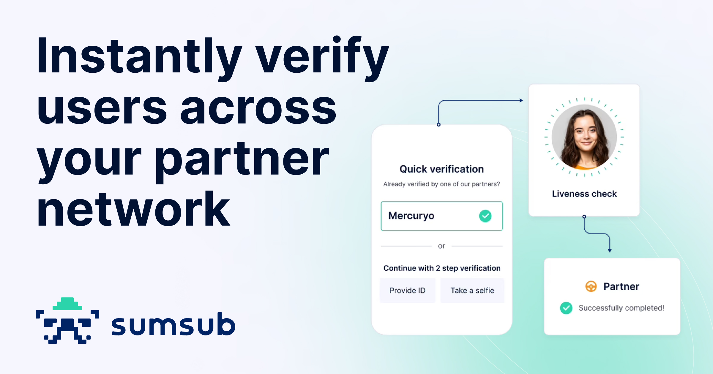

<div align="left">

[](https://sumsub.com&#x2F;)

# [Sumsub](https://sumsub.com&#x2F;)<a id="sumsub"></a>

Sumsub is the one verification platform to secure the whole user journey. With Sumsub's customizable KYC, KYB, transaction monitoring and fraud prevention solutions, you can orchestrate your verification process, welcome more customers worldwide, meet compliance requirements, reduce costs and protect your business.

Sumsub has over 2,000 clients in fintech, crypto, transportation, trading, e-commerce and gaming industries including Binance, Wirex, Avis, Bybit, Huobi, Unlimit, Flutter, Kaizen Gaming, and TransferGo.

</div>

## Table of Contents<a id="table-of-contents"></a>

<!-- toc -->

- [Installation](#installation)
- [Getting Started](#getting-started)
- [Reference](#reference)
  * [`sumsub.analysis.standaloneCryptoInitiation`](#sumsubanalysisstandalonecryptoinitiation)
  * [`sumsub.applicant.addBeneficiary`](#sumsubapplicantaddbeneficiary)
  * [`sumsub.applicant.addConsentToProfile`](#sumsubapplicantaddconsenttoprofile)
  * [`sumsub.applicant.addCustomTags`](#sumsubapplicantaddcustomtags)
  * [`sumsub.applicant.addCustomTags_0`](#sumsubapplicantaddcustomtags_0)
  * [`sumsub.applicant.addIdDocument`](#sumsubapplicantaddiddocument)
  * [`sumsub.applicant.addImageToPaymentMethod`](#sumsubapplicantaddimagetopaymentmethod)
  * [`sumsub.applicant.addPaymentMethodInformation`](#sumsubapplicantaddpaymentmethodinformation)
  * [`sumsub.applicant.addToBlocklist`](#sumsubapplicantaddtoblocklist)
  * [`sumsub.applicant.changeCompanyData`](#sumsubapplicantchangecompanydata)
  * [`sumsub.applicant.changeExtractedInfo`](#sumsubapplicantchangeextractedinfo)
  * [`sumsub.applicant.changeRequiredDocumentSet`](#sumsubapplicantchangerequireddocumentset)
  * [`sumsub.applicant.clarifyRejectionReason`](#sumsubapplicantclarifyrejectionreason)
  * [`sumsub.applicant.confirmData`](#sumsubapplicantconfirmdata)
  * [`sumsub.applicant.createAction`](#sumsubapplicantcreateaction)
  * [`sumsub.applicant.createCryptoSourceOfFunds`](#sumsubapplicantcreatecryptosourceoffunds)
  * [`sumsub.applicant.createPaymentSourceActions`](#sumsubapplicantcreatepaymentsourceactions)
  * [`sumsub.applicant.deactivateProfile`](#sumsubapplicantdeactivateprofile)
  * [`sumsub.applicant.enrichTransactionWithTravelRuleData`](#sumsubapplicantenrichtransactionwithtravelruledata)
  * [`sumsub.applicant.getActionOneInfo`](#sumsubapplicantgetactiononeinfo)
  * [`sumsub.applicant.getActions`](#sumsubapplicantgetactions)
  * [`sumsub.applicant.getBankCardImage`](#sumsubapplicantgetbankcardimage)
  * [`sumsub.applicant.getData`](#sumsubapplicantgetdata)
  * [`sumsub.applicant.getDataByExternalUserId`](#sumsubapplicantgetdatabyexternaluserid)
  * [`sumsub.applicant.getDataLatest`](#sumsubapplicantgetdatalatest)
  * [`sumsub.applicant.getFraudNetworkById`](#sumsubapplicantgetfraudnetworkbyid)
  * [`sumsub.applicant.getFraudNetworks`](#sumsubapplicantgetfraudnetworks)
  * [`sumsub.applicant.getFraudNetworksByApplicant`](#sumsubapplicantgetfraudnetworksbyapplicant)
  * [`sumsub.applicant.getLevels`](#sumsubapplicantgetlevels)
  * [`sumsub.applicant.getRequiredIdDocs`](#sumsubapplicantgetrequirediddocs)
  * [`sumsub.applicant.getReviewStatus`](#sumsubapplicantgetreviewstatus)
  * [`sumsub.applicant.getVerificationStepsStatus`](#sumsubapplicantgetverificationstepsstatus)
  * [`sumsub.applicant.getVideoCallMedia`](#sumsubapplicantgetvideocallmedia)
  * [`sumsub.applicant.importByArchive`](#sumsubapplicantimportbyarchive)
  * [`sumsub.applicant.importCompleted`](#sumsubapplicantimportcompleted)
  * [`sumsub.applicant.initiateApplicantCheck`](#sumsubapplicantinitiateapplicantcheck)
  * [`sumsub.applicant.moveTransactionToAnotherApplicant`](#sumsubapplicantmovetransactiontoanotherapplicant)
  * [`sumsub.applicant.removeCustomTags`](#sumsubapplicantremovecustomtags)
  * [`sumsub.applicant.removeFromBeneficiaryList`](#sumsubapplicantremovefrombeneficiarylist)
  * [`sumsub.applicant.requestActionCheck`](#sumsubapplicantrequestactioncheck)
  * [`sumsub.applicant.resetProfile`](#sumsubapplicantresetprofile)
  * [`sumsub.applicant.resetVerificationStep`](#sumsubapplicantresetverificationstep)
  * [`sumsub.applicant.sandboxVerificationResponse`](#sumsubapplicantsandboxverificationresponse)
  * [`sumsub.applicant.submitDataNoDocVerification`](#sumsubapplicantsubmitdatanodocverification)
  * [`sumsub.applicant.submitPaymentMethod`](#sumsubapplicantsubmitpaymentmethod)
  * [`sumsub.applicant.submitTransactionData`](#sumsubapplicantsubmittransactiondata)
  * [`sumsub.applicant.submitTransactionForNonExisting`](#sumsubapplicantsubmittransactionfornonexisting)
  * [`sumsub.applicant.updateFixedInfo`](#sumsubapplicantupdatefixedinfo)
  * [`sumsub.applicant.updateTopLevelInfo`](#sumsubapplicantupdatetoplevelinfo)
  * [`sumsub.auditTrailEvent.getEvents`](#sumsubaudittraileventgetevents)
  * [`sumsub.check.additionalCompanyData`](#sumsubcheckadditionalcompanydata)
  * [`sumsub.check.additionalPoaData`](#sumsubcheckadditionalpoadata)
  * [`sumsub.check.emailConfirmationResults`](#sumsubcheckemailconfirmationresults)
  * [`sumsub.check.ipCheckResults`](#sumsubcheckipcheckresults)
  * [`sumsub.check.performNameCrossValidation`](#sumsubcheckperformnamecrossvalidation)
  * [`sumsub.check.phoneConfirmationResults`](#sumsubcheckphoneconfirmationresults)
  * [`sumsub.check.tinSsnCheckResults`](#sumsubchecktinssncheckresults)
  * [`sumsub.health.statusApiGet`](#sumsubhealthstatusapiget)
  * [`sumsub.image.getDocumentImages`](#sumsubimagegetdocumentimages)
  * [`sumsub.image.markAsInactive`](#sumsubimagemarkasinactive)
  * [`sumsub.inspection.getVideoIdentData`](#sumsubinspectiongetvideoidentdata)
  * [`sumsub.note.addToTransaction`](#sumsubnoteaddtotransaction)
  * [`sumsub.note.getTransactionNotes`](#sumsubnotegettransactionnotes)
  * [`sumsub.note.removeFromTransaction`](#sumsubnoteremovefromtransaction)
  * [`sumsub.note.updateTransactionNotes`](#sumsubnoteupdatetransactionnotes)
  * [`sumsub.tag.addTransactionTags`](#sumsubtagaddtransactiontags)
  * [`sumsub.token.createActionToken`](#sumsubtokencreateactiontoken)
  * [`sumsub.token.getAvailableCurrencies`](#sumsubtokengetavailablecurrencies)
  * [`sumsub.transaction.approveReject`](#sumsubtransactionapprovereject)
  * [`sumsub.transaction.bulkImport`](#sumsubtransactionbulkimport)
  * [`sumsub.transaction.confirmOwnership`](#sumsubtransactionconfirmownership)
  * [`sumsub.transaction.getOneData`](#sumsubtransactiongetonedata)
  * [`sumsub.transaction.informationOne`](#sumsubtransactioninformationone)
  * [`sumsub.transaction.listTags`](#sumsubtransactionlisttags)
  * [`sumsub.transaction.reScore`](#sumsubtransactionrescore)
  * [`sumsub.transaction.removeOwnership`](#sumsubtransactionremoveownership)
  * [`sumsub.transaction.removeTags`](#sumsubtransactionremovetags)
  * [`sumsub.transaction.updateBlockchainInfo`](#sumsubtransactionupdateblockchaininfo)
  * [`sumsub.transaction.updateProperties`](#sumsubtransactionupdateproperties)
  * [`sumsub.vASP.getAvailableVasps`](#sumsubvaspgetavailablevasps)
  * [`sumsub.webSDKLink.generateExternal`](#sumsubwebsdklinkgenerateexternal)

<!-- tocstop -->

## Installation<a id="installation"></a>
<div align="center">
  <a href="https://konfigthis.com/sdk-sign-up?company=Sumsub&language=TypeScript">
    
  </a>
</div>

## Getting Started<a id="getting-started"></a>

```typescript
import { Sumsub } from "sumsub-typescript-sdk";

const sumsub = new Sumsub({
  // Defining the base path is optional and defaults to https://api.sumsub.com
  // basePath: "https://api.sumsub.com",
  apiKey: "API_KEY",
});

const standaloneCryptoInitiationResponse =
  await sumsub.analysis.standaloneCryptoInitiation({
    currency: "currency_example",
    direction: "direction_example",
    address: "address_example",
  });

console.log(standaloneCryptoInitiationResponse);
```

## Reference<a id="reference"></a>


### `sumsub.analysis.standaloneCryptoInitiation`<a id="sumsubanalysisstandalonecryptoinitiation"></a>

Initiates standalone crypto analysis.

#### 🛠️ Usage<a id="🛠️-usage"></a>

```typescript
const standaloneCryptoInitiationResponse =
  await sumsub.analysis.standaloneCryptoInitiation({
    currency: "currency_example",
    direction: "direction_example",
    address: "address_example",
  });
```

#### ⚙️ Parameters<a id="⚙️-parameters"></a>

##### currency: `string`<a id="currency-string"></a>

`BTC`, `ETH`, `BCH`, `LTC`, `USDT`, `ERC-20`, `BSV`, `XLM`, ...

##### direction: `string`<a id="direction-string"></a>

An operation type. Can be `withdrawal` or `deposit`.

##### address: `string`<a id="address-string"></a>

Target address hash.

##### txn: `string`<a id="txn-string"></a>

Transaction hash. For `withdrawals`, `txn` should not be set at all or set to `null`.

##### tokenId: `string`<a id="tokenid-string"></a>

Check the [Get available tokens](ref:get-available-tokens) method to get the full list of available currencies and token IDs.

#### 🌐 Endpoint<a id="🌐-endpoint"></a>

`/resources/standalone/crypto/cryptoSourceOfFunds` `POST`

[🔙 **Back to Table of Contents**](#table-of-contents)

---


### `sumsub.applicant.addBeneficiary`<a id="sumsubapplicantaddbeneficiary"></a>

Adds an existing individual applicant as a beneficiary.

#### 🛠️ Usage<a id="🛠️-usage"></a>

```typescript
const addBeneficiaryResponse = await sumsub.applicant.addBeneficiary({
  applicantId: "applicantId_example",
  requestBody: {
    applicant: {},
    applicantId: "applicantId_example",
    type: "type_example",
  },
});
```

#### ⚙️ Parameters<a id="⚙️-parameters"></a>

##### applicantId: `string`<a id="applicantid-string"></a>

A unique company applicant identifier.

##### requestBody: [`ApplicantAddBeneficiaryRequest`](./models/applicant-add-beneficiary-request.ts)<a id="requestbody-applicantaddbeneficiaryrequestmodelsapplicant-add-beneficiary-requestts"></a>

#### 🌐 Endpoint<a id="🌐-endpoint"></a>

`/resources/applicants/{applicantId}/info/companyInfo/beneficiaries` `POST`

[🔙 **Back to Table of Contents**](#table-of-contents)

---


### `sumsub.applicant.addConsentToProfile`<a id="sumsubapplicantaddconsenttoprofile"></a>

Adds a consent to an applicant profile.

#### 🛠️ Usage<a id="🛠️-usage"></a>

```typescript
const addConsentToProfileResponse = await sumsub.applicant.addConsentToProfile({
  applicantId: "applicantId_example",
  records: [{}],
});
```

#### ⚙️ Parameters<a id="⚙️-parameters"></a>

##### records: [`ApplicantAddConsentToProfileRequestRecordsInner`](./models/applicant-add-consent-to-profile-request-records-inner.ts)[]<a id="records-applicantaddconsenttoprofilerequestrecordsinnermodelsapplicant-add-consent-to-profile-request-records-innerts"></a>

An array of applicant consents.

##### applicantId: `string`<a id="applicantid-string"></a>

A unique identifier of an applicant profile to which a consent should be added.

##### acceptedAt: `string`<a id="acceptedat-string"></a>

Date and time a consent was accepted by the applicant.

##### residenceCountry: `string`<a id="residencecountry-string"></a>

An applicant country of residence.

#### 🌐 Endpoint<a id="🌐-endpoint"></a>

`/resources/applicants/{applicantId}/agreement` `POST`

[🔙 **Back to Table of Contents**](#table-of-contents)

---


### `sumsub.applicant.addCustomTags`<a id="sumsubapplicantaddcustomtags"></a>

Adds custom tags to applicant profiles.

#### 🛠️ Usage<a id="🛠️-usage"></a>

```typescript
const addCustomTagsResponse = await sumsub.applicant.addCustomTags({
  applicantId: "applicantId_example",
});
```

#### ⚙️ Parameters<a id="⚙️-parameters"></a>

##### applicantId: `string`<a id="applicantid-string"></a>

A unique applicant identifier.

##### RAW_BODY: `string`[]<a id="raw_body-string"></a>

#### 🌐 Endpoint<a id="🌐-endpoint"></a>

`/resources/applicants/{applicantId}/tags/add` `POST`

[🔙 **Back to Table of Contents**](#table-of-contents)

---


### `sumsub.applicant.addCustomTags_0`<a id="sumsubapplicantaddcustomtags_0"></a>

Adds and overwrites custom tags in applicant profiles.

#### 🛠️ Usage<a id="🛠️-usage"></a>

```typescript
const addCustomTags_0Response = await sumsub.applicant.addCustomTags_0({
  applicantId: "applicantId_example",
});
```

#### ⚙️ Parameters<a id="⚙️-parameters"></a>

##### applicantId: `string`<a id="applicantid-string"></a>

A unique applicant identifier.

##### RAW_BODY: `string`[]<a id="raw_body-string"></a>

#### 🌐 Endpoint<a id="🌐-endpoint"></a>

`/resources/applicants/{applicantId}/tags` `POST`

[🔙 **Back to Table of Contents**](#table-of-contents)

---


### `sumsub.applicant.addIdDocument`<a id="sumsubapplicantaddiddocument"></a>

Adds an identification document to be verified.

#### 🛠️ Usage<a id="🛠️-usage"></a>

```typescript
const addIdDocumentResponse = await sumsub.applicant.addIdDocument({
  xReturnDocWarnings: true,
  applicantId: "applicantId_example",
});
```

#### ⚙️ Parameters<a id="⚙️-parameters"></a>

##### xReturnDocWarnings: `boolean`<a id="xreturndocwarnings-boolean"></a>

`true` / `false`

##### applicantId: `string`<a id="applicantid-string"></a>

A unique applicant identifier.

##### metadata: [`ApplicantAddIdDocumentRequestMetadata`](./models/applicant-add-id-document-request-metadata.ts)<a id="metadata-applicantaddiddocumentrequestmetadatamodelsapplicant-add-id-document-request-metadatats"></a>

##### content: `Uint8Array | File | buffer.File`<a id="content-uint8array--file--bufferfile"></a>

A photo of the document.

#### 🔄 Return<a id="🔄-return"></a>

[ApplicantAddIdDocumentResponse](./models/applicant-add-id-document-response.ts)

#### 🌐 Endpoint<a id="🌐-endpoint"></a>

`/resources/applicants/{applicantId}/info/idDoc` `POST`

[🔙 **Back to Table of Contents**](#table-of-contents)

---


### `sumsub.applicant.addImageToPaymentMethod`<a id="sumsubapplicantaddimagetopaymentmethod"></a>

Adds an image to the payment method.

#### 🛠️ Usage<a id="🛠️-usage"></a>

```typescript
const addImageToPaymentMethodResponse =
  await sumsub.applicant.addImageToPaymentMethod({
    actionId: "actionId_example",
    content: fs.readFileSync("/path/to/file"),
    metadata: {
      idDocType: "idDocType_example",
      country: "country_example",
    },
  });
```

#### ⚙️ Parameters<a id="⚙️-parameters"></a>

##### content: `Uint8Array | File | buffer.File`<a id="content-uint8array--file--bufferfile"></a>

A document photo.

##### metadata: [`ApplicantAddImageToPaymentMethodRequestMetadata`](./models/applicant-add-image-to-payment-method-request-metadata.ts)<a id="metadata-applicantaddimagetopaymentmethodrequestmetadatamodelsapplicant-add-image-to-payment-method-request-metadatats"></a>

##### actionId: `string`<a id="actionid-string"></a>

A unique applicant action identifier.

#### 🌐 Endpoint<a id="🌐-endpoint"></a>

`/resources/applicantActions/{actionId}/images` `POST`

[🔙 **Back to Table of Contents**](#table-of-contents)

---


### `sumsub.applicant.addPaymentMethodInformation`<a id="sumsubapplicantaddpaymentmethodinformation"></a>

Adds additional information to the payment method.

#### 🛠️ Usage<a id="🛠️-usage"></a>

```typescript
const addPaymentMethodInformationResponse =
  await sumsub.applicant.addPaymentMethodInformation({
    actionId: "actionId_example",
    type: "type_example",
  });
```

#### ⚙️ Parameters<a id="⚙️-parameters"></a>

##### type: `string`<a id="type-string"></a>

A payment type. Can be: `bankCard`, `eWallet`, `wireTransfer`.

##### actionId: `string`<a id="actionid-string"></a>

A unique applicant action identifier.

##### subType: `string`<a id="subtype-string"></a>

A payment subtype. For example, `VISA`, `MASTERCARD`, etc.

##### data: [`ApplicantCreateActionRequestPaymentMethodData`](./models/applicant-create-action-request-payment-method-data.ts)<a id="data-applicantcreateactionrequestpaymentmethoddatamodelsapplicant-create-action-request-payment-method-datats"></a>

#### 🌐 Endpoint<a id="🌐-endpoint"></a>

`/resources/applicantActions/{actionId}/paymentMethod` `POST`

[🔙 **Back to Table of Contents**](#table-of-contents)

---


### `sumsub.applicant.addToBlocklist`<a id="sumsubapplicantaddtoblocklist"></a>

Add an applicant to blocklist.

#### 🛠️ Usage<a id="🛠️-usage"></a>

```typescript
const addToBlocklistResponse = await sumsub.applicant.addToBlocklist({
  note: "note_example",
  applicantId: "applicantId_example",
});
```

#### ⚙️ Parameters<a id="⚙️-parameters"></a>

##### note: `string`<a id="note-string"></a>

A note indicating the reason for blocklisting the applicant profile.

##### applicantId: `string`<a id="applicantid-string"></a>

A unique applicant identifier.

#### 🌐 Endpoint<a id="🌐-endpoint"></a>

`/resources/applicants/{applicantId}/blacklist?note&#x3D;{note}` `POST`

[🔙 **Back to Table of Contents**](#table-of-contents)

---


### `sumsub.applicant.changeCompanyData`<a id="sumsubapplicantchangecompanydata"></a>

Changes company data.

#### 🛠️ Usage<a id="🛠️-usage"></a>

```typescript
const changeCompanyDataResponse = await sumsub.applicant.changeCompanyData({
  applicantId: "applicantId_example",
  companyName: "companyName_example",
  registrationNumber: "registrationNumber_example",
});
```

#### ⚙️ Parameters<a id="⚙️-parameters"></a>

##### companyName: `string`<a id="companyname-string"></a>

Name of the company.

##### registrationNumber: `string`<a id="registrationnumber-string"></a>

Registration number.

##### applicantId: `string`<a id="applicantid-string"></a>

A unique applicant identifier.

##### country: `string`<a id="country-string"></a>

A three-letter country code (e.g. `DEU`).

##### legalAddress: `string`<a id="legaladdress-string"></a>

Legal name.

##### incorporatedOn: `string`<a id="incorporatedon-string"></a>

Date of incorporation (format `YYYY-mm-dd`, e.g. 2001-09-25).

##### type: `string`<a id="type-string"></a>

Type of entity.

##### email: `string`<a id="email-string"></a>

Email address.

##### controlScheme: `string`<a id="controlscheme-string"></a>

Description of the control scheme of the group of entities.

##### phone: `string`<a id="phone-string"></a>

Phone number.

##### taxId: `string`<a id="taxid-string"></a>

Taxpayer registration number/Code of taxpayer registration.

##### registrationLocation: `string`<a id="registrationlocation-string"></a>

Location of registration.

##### website: `string`<a id="website-string"></a>

Website\\\'s URL.

##### postalAddress: `string`<a id="postaladdress-string"></a>

Postal address.

##### beneficiaries: `string`[]<a id="beneficiaries-string"></a>

Contains applicantIds of beneficiaries and additional info like position and type.

##### addresses: `string`[]<a id="addresses-string"></a>

List of addresses.

#### 🌐 Endpoint<a id="🌐-endpoint"></a>

`/resources/applicants/{applicantId}/info/companyInfo` `PATCH`

[🔙 **Back to Table of Contents**](#table-of-contents)

---


### `sumsub.applicant.changeExtractedInfo`<a id="sumsubapplicantchangeextractedinfo"></a>

Changes extracted information.

#### 🛠️ Usage<a id="🛠️-usage"></a>

```typescript
const changeExtractedInfoResponse = await sumsub.applicant.changeExtractedInfo({
  applicantId: "applicantId_example",
});
```

#### ⚙️ Parameters<a id="⚙️-parameters"></a>

##### applicantId: `string`<a id="applicantid-string"></a>

A unique applicant identifier.

##### firstName: `string`<a id="firstname-string"></a>

The first name of the applicant.

##### lastName: `string`<a id="lastname-string"></a>

The last name of the applicant.

##### middleName: `string`<a id="middlename-string"></a>

The middle name of the applicant.

##### legalName: `string`<a id="legalname-string"></a>

Legal name.

##### gender: `string`<a id="gender-string"></a>

An applicant gender (`M` or `F`).

##### dob: `string`<a id="dob-string"></a>

Applicant date of birth (format `YYYY-mm-dd`, e.g. 2001-09-25).

##### placeOfBirth: `string`<a id="placeofbirth-string"></a>

The applicant birthplace.

##### countryOfBirth: `string`<a id="countryofbirth-string"></a>

Applicant country of birth.

##### stateOfBirth: `string`<a id="stateofbirth-string"></a>

Applicant state of birth.

##### country: `string`<a id="country-string"></a>

Alpha-3 country code (e.g. `DEU` or `GBR`).

##### nationality: `string`<a id="nationality-string"></a>

Alpha-3 country code.

##### addresses: `string`<a id="addresses-string"></a>

List of applicant addresses.

##### tin: `string`<a id="tin-string"></a>

Tax identification number.

#### 🌐 Endpoint<a id="🌐-endpoint"></a>

`/resources/applicants/{applicantId}/info` `PATCH`

[🔙 **Back to Table of Contents**](#table-of-contents)

---


### `sumsub.applicant.changeRequiredDocumentSet`<a id="sumsubapplicantchangerequireddocumentset"></a>

Changes the list of required documents.

#### 🛠️ Usage<a id="🛠️-usage"></a>

```typescript
const changeRequiredDocumentSetResponse =
  await sumsub.applicant.changeRequiredDocumentSet({
    name: "name_example",
    applicantId: "applicantId_example",
  });
```

#### ⚙️ Parameters<a id="⚙️-parameters"></a>

##### name: `string`<a id="name-string"></a>

A [verification level](https://docs.sumsub.com/reference) name. Case-sensitive and has to be created in the same environment. If contains reserved characters (e.g., `@`, `+\"`, white spaces as `%20`), it should be URL-encoded, otherwise you may get signature mismatch.

##### applicantId: `string`<a id="applicantid-string"></a>

A unique applicant identifier.

#### 🌐 Endpoint<a id="🌐-endpoint"></a>

`/resources/applicants/{applicantId}/moveToLevel` `POST`

[🔙 **Back to Table of Contents**](#table-of-contents)

---


### `sumsub.applicant.clarifyRejectionReason`<a id="sumsubapplicantclarifyrejectionreason"></a>

Returns rejection reason clarification.

#### 🛠️ Usage<a id="🛠️-usage"></a>

```typescript
const clarifyRejectionReasonResponse =
  await sumsub.applicant.clarifyRejectionReason({
    applicantId: "applicantId_example",
  });
```

#### ⚙️ Parameters<a id="⚙️-parameters"></a>

##### applicantId: `string`<a id="applicantid-string"></a>

A unique applicant identifier.

#### 🌐 Endpoint<a id="🌐-endpoint"></a>

`/resources/moderationStates/-;applicantId&#x3D;{applicantId}` `GET`

[🔙 **Back to Table of Contents**](#table-of-contents)

---


### `sumsub.applicant.confirmData`<a id="sumsubapplicantconfirmdata"></a>

Confirms applicant data.

#### 🛠️ Usage<a id="🛠️-usage"></a>

```typescript
const confirmDataResponse = await sumsub.applicant.confirmData({
  applicantId: "applicantId_example",
  confirmationId: "confirmationId_example",
});
```

#### ⚙️ Parameters<a id="⚙️-parameters"></a>

##### applicantId: `string`<a id="applicantid-string"></a>

A unique applicant identifier.

##### confirmationId: `string`<a id="confirmationid-string"></a>

A confirmation identifier from the [submission](ref:submit-applicant-data) response.

##### otp: [`ApplicantConfirmDataRequestOtp`](./models/applicant-confirm-data-request-otp.ts)<a id="otp-applicantconfirmdatarequestotpmodelsapplicant-confirm-data-request-otpts"></a>

##### oauth: [`ApplicantConfirmDataRequestOauth`](./models/applicant-confirm-data-request-oauth.ts)<a id="oauth-applicantconfirmdatarequestoauthmodelsapplicant-confirm-data-request-oauthts"></a>

#### 🌐 Endpoint<a id="🌐-endpoint"></a>

`/resources/applicants/{applicantId}/ekyc/confirm/{confirmationid}` `POST`

[🔙 **Back to Table of Contents**](#table-of-contents)

---


### `sumsub.applicant.createAction`<a id="sumsubapplicantcreateaction"></a>

Creates an applicant action.

#### 🛠️ Usage<a id="🛠️-usage"></a>

```typescript
const createActionResponse = await sumsub.applicant.createAction({
  applicantId: "applicantId_example",
  levelName: "levelName_example",
  externalActionId: "externalActionId_example",
});
```

#### ⚙️ Parameters<a id="⚙️-parameters"></a>

##### externalActionId: `string`<a id="externalactionid-string"></a>

An external action ID which will be bound to the token.

##### applicantId: `string`<a id="applicantid-string"></a>

A unique aplicant identifier.

##### levelName: `string`<a id="levelname-string"></a>

A name of the level configured in the dashboard.

##### paymentMethod: [`ApplicantCreateActionRequestPaymentMethod`](./models/applicant-create-action-request-payment-method.ts)<a id="paymentmethod-applicantcreateactionrequestpaymentmethodmodelsapplicant-create-action-request-payment-methodts"></a>

##### email: `string`<a id="email-string"></a>

Applicant email address.

##### phone: `string`<a id="phone-string"></a>

Applicant phone number.

#### 🌐 Endpoint<a id="🌐-endpoint"></a>

`/resources/applicantActions/-/forApplicant/{applicantId}?levelName&#x3D;{levelName}` `POST`

[🔙 **Back to Table of Contents**](#table-of-contents)

---


### `sumsub.applicant.createCryptoSourceOfFunds`<a id="sumsubapplicantcreatecryptosourceoffunds"></a>

Creates an action with transaction information.

#### 🛠️ Usage<a id="🛠️-usage"></a>

```typescript
const createCryptoSourceOfFundsResponse =
  await sumsub.applicant.createCryptoSourceOfFunds({
    applicantId: "applicantId_example",
    currency: "currency_example",
    direction: "direction_example",
    address: "address_example",
  });
```

#### ⚙️ Parameters<a id="⚙️-parameters"></a>

##### currency: `string`<a id="currency-string"></a>

`BTC`, `ETH`, `BCH`, `LTC`, `USDT`, `ERC-20`, `BSV`, `XLM`, ...

##### direction: `string`<a id="direction-string"></a>

Operation type. Can be `withdrawal` or `deposit`.

##### address: `string`<a id="address-string"></a>

Target address hash.

##### applicantId: `string`<a id="applicantid-string"></a>

A unique applicant identifier.

##### txn: `string`<a id="txn-string"></a>

Transaction hash. For `withdrawals`, `txn` should not be set at all or set to `null`.

##### tokenId: `string`<a id="tokenid-string"></a>

Check the [Get available tokens](ref:get-available-tokens) method to get the full list of available currencies and token IDs.

#### 🌐 Endpoint<a id="🌐-endpoint"></a>

`/resources/applicantActions/-/forApplicant/{applicantId}/cryptoSourceOfFunds` `POST`

[🔙 **Back to Table of Contents**](#table-of-contents)

---


### `sumsub.applicant.createPaymentSourceActions`<a id="sumsubapplicantcreatepaymentsourceactions"></a>

Creates an action to process a payment source and to confirm the owner of the payment method.

#### 🛠️ Usage<a id="🛠️-usage"></a>

```typescript
const createPaymentSourceActionsResponse =
  await sumsub.applicant.createPaymentSourceActions({
    applicantId: "applicantId_example",
    levelName: "levelName_example",
  });
```

#### ⚙️ Parameters<a id="⚙️-parameters"></a>

##### applicantId: `string`<a id="applicantid-string"></a>

An unique applicant identifier.

##### levelName: `string`<a id="levelname-string"></a>

A verification level name for which you want to create a payment source action.

##### externalActionId: `string`<a id="externalactionid-string"></a>

An external identifier for an action.

##### paymentSource: [`ApplicantCreatePaymentSourceActionsRequestPaymentSource`](./models/applicant-create-payment-source-actions-request-payment-source.ts)<a id="paymentsource-applicantcreatepaymentsourceactionsrequestpaymentsourcemodelsapplicant-create-payment-source-actions-request-payment-sourcets"></a>

#### 🔄 Return<a id="🔄-return"></a>

[ApplicantCreatePaymentSourceActionsResponse](./models/applicant-create-payment-source-actions-response.ts)

#### 🌐 Endpoint<a id="🌐-endpoint"></a>

`/resources/applicantActions/-/forApplicant/{applicantId}/?levelName&#x3D;paymentSource` `POST`

[🔙 **Back to Table of Contents**](#table-of-contents)

---


### `sumsub.applicant.deactivateProfile`<a id="sumsubapplicantdeactivateprofile"></a>

Deactivates an applicant profile.

#### 🛠️ Usage<a id="🛠️-usage"></a>

```typescript
const deactivateProfileResponse = await sumsub.applicant.deactivateProfile({
  applicantId: "applicantId_example",
  status: "status_example",
});
```

#### ⚙️ Parameters<a id="⚙️-parameters"></a>

##### applicantId: `string`<a id="applicantid-string"></a>

A unique applicant identifier.

##### status: `string`<a id="status-string"></a>

Possible values: `deactivated` to deactivate the applicant profile. `activated` to reactivate the applicant profile.

#### 🌐 Endpoint<a id="🌐-endpoint"></a>

`/resources/applicants/{applicantId}/presence/{status}` `PATCH`

[🔙 **Back to Table of Contents**](#table-of-contents)

---


### `sumsub.applicant.enrichTransactionWithTravelRuleData`<a id="sumsubapplicantenrichtransactionwithtravelruledata"></a>

Enriches transaction with the Travel Rule data.

#### 🛠️ Usage<a id="🛠️-usage"></a>

```typescript
const enrichTransactionWithTravelRuleDataResponse =
  await sumsub.applicant.enrichTransactionWithTravelRuleData({
    txnId: "txnId_example",
    fullName: "fullName_example",
  });
```

#### ⚙️ Parameters<a id="⚙️-parameters"></a>

##### fullName: `string`<a id="fullname-string"></a>

Participant full name.

##### txnId: `string`<a id="txnid-string"></a>

A unique transaction identifier.

#### 🌐 Endpoint<a id="🌐-endpoint"></a>

`/resources/kyt/txns/{txnId}/data/applicant` `PATCH`

[🔙 **Back to Table of Contents**](#table-of-contents)

---


### `sumsub.applicant.getActionOneInfo`<a id="sumsubapplicantgetactiononeinfo"></a>

Returns information about the applicant action checks.

#### 🛠️ Usage<a id="🛠️-usage"></a>

```typescript
const getActionOneInfoResponse = await sumsub.applicant.getActionOneInfo({
  actionId: "actionId_example",
});
```

#### ⚙️ Parameters<a id="⚙️-parameters"></a>

##### actionId: `string`<a id="actionid-string"></a>

A unique applicant action identifier.

#### 🌐 Endpoint<a id="🌐-endpoint"></a>

`/resources/applicantActions/{actionId}/one` `GET`

[🔙 **Back to Table of Contents**](#table-of-contents)

---


### `sumsub.applicant.getActions`<a id="sumsubapplicantgetactions"></a>

Returns a list of applicant actions.

#### 🛠️ Usage<a id="🛠️-usage"></a>

```typescript
const getActionsResponse = await sumsub.applicant.getActions({
  limit: 1000,
  offset: 0,
  applicantId: "applicantId_example",
});
```

#### ⚙️ Parameters<a id="⚙️-parameters"></a>

##### applicantId: `string`<a id="applicantid-string"></a>

A unique applicant identifier.

##### limit: `number`<a id="limit-number"></a>

Limit of applicant actions to be returned.

##### offset: `number`<a id="offset-number"></a>

Offset of applicant actions to be returned.

#### 🌐 Endpoint<a id="🌐-endpoint"></a>

`/resources/applicantActions/-;applicantId&#x3D;{applicantId}` `GET`

[🔙 **Back to Table of Contents**](#table-of-contents)

---


### `sumsub.applicant.getBankCardImage`<a id="sumsubapplicantgetbankcardimage"></a>

Returns an original bank card image.

#### 🛠️ Usage<a id="🛠️-usage"></a>

```typescript
const getBankCardImageResponse = await sumsub.applicant.getBankCardImage({
  isPreview: false,
  actionId: "actionId_example",
  imageId: "imageId_example",
});
```

#### ⚙️ Parameters<a id="⚙️-parameters"></a>

##### actionId: `string`<a id="actionid-string"></a>

A unique applicant action identifier.

##### imageId: `string`<a id="imageid-string"></a>

An image identifier taken from `images[].imageId`.

##### isPreview: `boolean`<a id="ispreview-boolean"></a>

Indicates if an image thumbnail should be returned.

#### 🌐 Endpoint<a id="🌐-endpoint"></a>

`/resources/applicantActions/{actionId}/images/{imageId}?preview&#x3D;{isPreview}` `GET`

[🔙 **Back to Table of Contents**](#table-of-contents)

---


### `sumsub.applicant.getData`<a id="sumsubapplicantgetdata"></a>

Returns applicant information.

#### 🛠️ Usage<a id="🛠️-usage"></a>

```typescript
const getDataResponse = await sumsub.applicant.getData({
  applicantId: "applicantId_example",
});
```

#### ⚙️ Parameters<a id="⚙️-parameters"></a>

##### applicantId: `string`<a id="applicantid-string"></a>

A unique applicant identifier

#### 🌐 Endpoint<a id="🌐-endpoint"></a>

`/resources/applicants/{applicantId}/one` `GET`

[🔙 **Back to Table of Contents**](#table-of-contents)

---


### `sumsub.applicant.getDataByExternalUserId`<a id="sumsubapplicantgetdatabyexternaluserid"></a>

Returns applicant information based on the provided `externalUserId`.

#### 🛠️ Usage<a id="🛠️-usage"></a>

```typescript
const getDataByExternalUserIdResponse =
  await sumsub.applicant.getDataByExternalUserId({
    externalUserId: "externalUserId_example",
  });
```

#### ⚙️ Parameters<a id="⚙️-parameters"></a>

##### externalUserId: `string`<a id="externaluserid-string"></a>

A unique applicant identifier in your system.

#### 🌐 Endpoint<a id="🌐-endpoint"></a>

`/resources/applicants/-;externalUserId&#x3D;{externalUserId}/one` `GET`

[🔙 **Back to Table of Contents**](#table-of-contents)

---


### `sumsub.applicant.getDataLatest`<a id="sumsubapplicantgetdatalatest"></a>

Returns the applicant data for Non-Doc verification.

#### 🛠️ Usage<a id="🛠️-usage"></a>

```typescript
const getDataLatestResponse = await sumsub.applicant.getDataLatest({
  type: "E_KYC_CHECK",
  applicantId: "applicantId_example",
});
```

#### ⚙️ Parameters<a id="⚙️-parameters"></a>

##### type: `'E_KYC_CHECK' | 'RESIDENCY_CHECK'`<a id="type-e_kyc_check--residency_check"></a>

Check type.

##### applicantId: `string`<a id="applicantid-string"></a>

A unique applicant identifier.

#### 🌐 Endpoint<a id="🌐-endpoint"></a>

`/resources/checks/latest` `GET`

[🔙 **Back to Table of Contents**](#table-of-contents)

---


### `sumsub.applicant.getFraudNetworkById`<a id="sumsubapplicantgetfraudnetworkbyid"></a>

Returns fraud network by `networkId`.

#### 🛠️ Usage<a id="🛠️-usage"></a>

```typescript
const getFraudNetworkByIdResponse = await sumsub.applicant.getFraudNetworkById({
  networkId: "networkId_example",
});
```

#### ⚙️ Parameters<a id="⚙️-parameters"></a>

##### networkId: `string`<a id="networkid-string"></a>

A unique network identifier.

#### 🌐 Endpoint<a id="🌐-endpoint"></a>

`/resources/applicantFraudNetworks/{networkId}/one` `GET`

[🔙 **Back to Table of Contents**](#table-of-contents)

---


### `sumsub.applicant.getFraudNetworks`<a id="sumsubapplicantgetfraudnetworks"></a>

Returns fraud networks.

#### 🛠️ Usage<a id="🛠️-usage"></a>

```typescript
const getFraudNetworksResponse = await sumsub.applicant.getFraudNetworks({
  offset: 0,
  limit: 10,
});
```

#### ⚙️ Parameters<a id="⚙️-parameters"></a>

##### offset: `number`<a id="offset-number"></a>

Offset of the found networks to be returned.

##### limit: `number`<a id="limit-number"></a>

Maximum number of the found networks to be returned. The maximum value you can set is 100.

#### 🌐 Endpoint<a id="🌐-endpoint"></a>

`/resources/applicantFraudNetworks` `GET`

[🔙 **Back to Table of Contents**](#table-of-contents)

---


### `sumsub.applicant.getFraudNetworksByApplicant`<a id="sumsubapplicantgetfraudnetworksbyapplicant"></a>

Returns all fraud networks by `applicantId`.

#### 🛠️ Usage<a id="🛠️-usage"></a>

```typescript
const getFraudNetworksByApplicantResponse =
  await sumsub.applicant.getFraudNetworksByApplicant({
    applicantId: "applicantId_example",
  });
```

#### ⚙️ Parameters<a id="⚙️-parameters"></a>

##### applicantId: `string`<a id="applicantid-string"></a>

A unique applicant identifier.

#### 🌐 Endpoint<a id="🌐-endpoint"></a>

`/resources/applicantFraudNetworks/-/byApplicant/{applicantId}` `GET`

[🔙 **Back to Table of Contents**](#table-of-contents)

---


### `sumsub.applicant.getLevels`<a id="sumsubapplicantgetlevels"></a>

Returns a list of verification levels.

#### 🛠️ Usage<a id="🛠️-usage"></a>

```typescript
const getLevelsResponse = await sumsub.applicant.getLevels();
```

#### 🌐 Endpoint<a id="🌐-endpoint"></a>

`/resources/applicants/-/levels` `GET`

[🔙 **Back to Table of Contents**](#table-of-contents)

---


### `sumsub.applicant.getRequiredIdDocs`<a id="sumsubapplicantgetrequirediddocs"></a>

Returns the list of required documents.

#### 🛠️ Usage<a id="🛠️-usage"></a>

```typescript
const getRequiredIdDocsResponse = await sumsub.applicant.getRequiredIdDocs({
  applicantId: "applicantId_example",
});
```

#### ⚙️ Parameters<a id="⚙️-parameters"></a>

##### applicantId: `string`<a id="applicantid-string"></a>

A unique applicant identifier.

#### 🌐 Endpoint<a id="🌐-endpoint"></a>

`/resources/applicants/{applicantId}/requiredIdDocs` `POST`

[🔙 **Back to Table of Contents**](#table-of-contents)

---


### `sumsub.applicant.getReviewStatus`<a id="sumsubapplicantgetreviewstatus"></a>

Returns applicant review status.

#### 🛠️ Usage<a id="🛠️-usage"></a>

```typescript
const getReviewStatusResponse = await sumsub.applicant.getReviewStatus({
  applicantId: "applicantId_example",
});
```

#### ⚙️ Parameters<a id="⚙️-parameters"></a>

##### applicantId: `string`<a id="applicantid-string"></a>

A unique applicant identifier.

#### 🌐 Endpoint<a id="🌐-endpoint"></a>

`/resources/applicants/{applicantId}/status` `GET`

[🔙 **Back to Table of Contents**](#table-of-contents)

---


### `sumsub.applicant.getVerificationStepsStatus`<a id="sumsubapplicantgetverificationstepsstatus"></a>

Returns information about the documents or separate verification step results.

#### 🛠️ Usage<a id="🛠️-usage"></a>

```typescript
const getVerificationStepsStatusResponse =
  await sumsub.applicant.getVerificationStepsStatus({
    applicantId: "applicantId_example",
  });
```

#### ⚙️ Parameters<a id="⚙️-parameters"></a>

##### applicantId: `string`<a id="applicantid-string"></a>

A unique applicant identifier.

#### 🌐 Endpoint<a id="🌐-endpoint"></a>

`/resources/applicants/{applicantId}/requiredIdDocsStatus` `GET`

[🔙 **Back to Table of Contents**](#table-of-contents)

---


### `sumsub.applicant.getVideoCallMedia`<a id="sumsubapplicantgetvideocallmedia"></a>

Returns video call media.

#### 🛠️ Usage<a id="🛠️-usage"></a>

```typescript
const getVideoCallMediaResponse = await sumsub.applicant.getVideoCallMedia({
  applicantId: "applicantId_example",
  compositionMediaId: "compositionMediaId_example",
});
```

#### ⚙️ Parameters<a id="⚙️-parameters"></a>

##### applicantId: `string`<a id="applicantid-string"></a>

A unique applicant identifier.

##### compositionMediaId: `string`<a id="compositionmediaid-string"></a>

Video call media identifier.

#### 🌐 Endpoint<a id="🌐-endpoint"></a>

`/resources/videoIdent/applicant/{applicantId}/media/{compositionMediaId}` `GET`

[🔙 **Back to Table of Contents**](#table-of-contents)

---


### `sumsub.applicant.importByArchive`<a id="sumsubapplicantimportbyarchive"></a>

Imports applicant data and images including associated review results.

#### 🛠️ Usage<a id="🛠️-usage"></a>

```typescript
const importByArchiveResponse = await sumsub.applicant.importByArchive({});
```

#### ⚙️ Parameters<a id="⚙️-parameters"></a>

##### content: `Uint8Array | File | buffer.File`<a id="content-uint8array--file--bufferfile"></a>

An archive file.

#### 🌐 Endpoint<a id="🌐-endpoint"></a>

`/resources/applicants/-/applicantImport` `POST`

[🔙 **Back to Table of Contents**](#table-of-contents)

---


### `sumsub.applicant.importCompleted`<a id="sumsubapplicantimportcompleted"></a>

Imports applicants.

#### 🛠️ Usage<a id="🛠️-usage"></a>

```typescript
const importCompletedResponse = await sumsub.applicant.importCompleted({});
```

#### ⚙️ Parameters<a id="⚙️-parameters"></a>

##### info: [`ApplicantImportCompletedRequestInfo`](./models/applicant-import-completed-request-info.ts)<a id="info-applicantimportcompletedrequestinfomodelsapplicant-import-completed-request-infots"></a>

##### externalUserId: `string`<a id="externaluserid-string"></a>

someClientUserId

##### review: [`ApplicantImportCompletedRequestReview`](./models/applicant-import-completed-request-review.ts)<a id="review-applicantimportcompletedrequestreviewmodelsapplicant-import-completed-request-reviewts"></a>

##### levelName: `string`<a id="levelname-string"></a>

A [verification level](https://docs.sumsub.com/reference) name. Case-sensitive and has to be created in the same environment. If contains reserved characters (e.g., `@`, `+\"`, white spaces as `%20`), it should be URL-encoded, otherwise you may get signature mismatch.

#### 🌐 Endpoint<a id="🌐-endpoint"></a>

`/resources/applicants/-/ingestCompleted?levelName&#x3D;{levelName}` `POST`

[🔙 **Back to Table of Contents**](#table-of-contents)

---


### `sumsub.applicant.initiateApplicantCheck`<a id="sumsubapplicantinitiateapplicantcheck"></a>

Initiates a check of the applicant profile.

#### 🛠️ Usage<a id="🛠️-usage"></a>

```typescript
const initiateApplicantCheckResponse =
  await sumsub.applicant.initiateApplicantCheck({
    applicantId: "applicantId_example",
  });
```

#### ⚙️ Parameters<a id="⚙️-parameters"></a>

##### applicantId: `string`<a id="applicantid-string"></a>

A unique applicant identifier.

##### reason: `string`<a id="reason-string"></a>

A note indicating the reason for checking the applicant profile.

#### 🌐 Endpoint<a id="🌐-endpoint"></a>

`/resources/applicants/{applicantId}/status/pending?reason&#x3D;{reason}` `POST`

[🔙 **Back to Table of Contents**](#table-of-contents)

---


### `sumsub.applicant.moveTransactionToAnotherApplicant`<a id="sumsubapplicantmovetransactiontoanotherapplicant"></a>

Moves transaction to the specified applicant.

#### 🛠️ Usage<a id="🛠️-usage"></a>

```typescript
const moveTransactionToAnotherApplicantResponse =
  await sumsub.applicant.moveTransactionToAnotherApplicant({
    txnId: "txnId_example",
    applicantId: "applicantId_example",
  });
```

#### ⚙️ Parameters<a id="⚙️-parameters"></a>

##### txnId: `string`<a id="txnid-string"></a>

A unique transaction identifier.

##### applicantId: `string`<a id="applicantid-string"></a>

A unique applicant identifier who should own the transaction.

#### 🌐 Endpoint<a id="🌐-endpoint"></a>

`/resources/kyt/txns/{txnId}/applicantId/{applicantId}` `POST`

[🔙 **Back to Table of Contents**](#table-of-contents)

---


### `sumsub.applicant.removeCustomTags`<a id="sumsubapplicantremovecustomtags"></a>

Removes all custom tags from applicant profiles.

#### 🛠️ Usage<a id="🛠️-usage"></a>

```typescript
const removeCustomTagsResponse = await sumsub.applicant.removeCustomTags({
  applicantId: "applicantId_example",
});
```

#### ⚙️ Parameters<a id="⚙️-parameters"></a>

##### applicantId: `string`<a id="applicantid-string"></a>

A unique applicant identifier.

##### RAW_BODY: `string`[]<a id="raw_body-string"></a>

#### 🌐 Endpoint<a id="🌐-endpoint"></a>

`/resources/applicants/{applicantId}/tags` `DELETE`

[🔙 **Back to Table of Contents**](#table-of-contents)

---


### `sumsub.applicant.removeFromBeneficiaryList`<a id="sumsubapplicantremovefrombeneficiarylist"></a>

Removes the applicant from the list of company beneficial owners.

#### 🛠️ Usage<a id="🛠️-usage"></a>

```typescript
const removeFromBeneficiaryListResponse =
  await sumsub.applicant.removeFromBeneficiaryList({
    applicantId: "applicantId_example",
    beneficiaryApplicantId: "beneficiaryApplicantId_example",
  });
```

#### ⚙️ Parameters<a id="⚙️-parameters"></a>

##### applicantId: `string`<a id="applicantid-string"></a>

A unique company applicant identifier.

##### beneficiaryApplicantId: `string`<a id="beneficiaryapplicantid-string"></a>

Beneficiary applicant identifier.

#### 🌐 Endpoint<a id="🌐-endpoint"></a>

`/resources/applicants/{applicantId}/info/companyInfo/beneficiaries/{beneficiaryApplicantId}` `DELETE`

[🔙 **Back to Table of Contents**](#table-of-contents)

---


### `sumsub.applicant.requestActionCheck`<a id="sumsubapplicantrequestactioncheck"></a>

Requests an applicant action check.

#### 🛠️ Usage<a id="🛠️-usage"></a>

```typescript
const requestActionCheckResponse = await sumsub.applicant.requestActionCheck({
  actionId: "actionId_example",
});
```

#### ⚙️ Parameters<a id="⚙️-parameters"></a>

##### actionId: `string`<a id="actionid-string"></a>

A unique applicant action identifier.

#### 🌐 Endpoint<a id="🌐-endpoint"></a>

`/resources/applicantActions/{actionId}/review/status/pending` `POST`

[🔙 **Back to Table of Contents**](#table-of-contents)

---


### `sumsub.applicant.resetProfile`<a id="sumsubapplicantresetprofile"></a>

Marks documents uploaded by the applicant as inactive and deletes all statuses assigned earlier.

#### 🛠️ Usage<a id="🛠️-usage"></a>

```typescript
const resetProfileResponse = await sumsub.applicant.resetProfile({
  applicantId: "applicantId_example",
});
```

#### ⚙️ Parameters<a id="⚙️-parameters"></a>

##### applicantId: `string`<a id="applicantid-string"></a>

A unique applicant identifier.

#### 🌐 Endpoint<a id="🌐-endpoint"></a>

`/resources/applicants/{applicantId}/reset` `POST`

[🔙 **Back to Table of Contents**](#table-of-contents)

---


### `sumsub.applicant.resetVerificationStep`<a id="sumsubapplicantresetverificationstep"></a>

Resets the specified verification step.

#### 🛠️ Usage<a id="🛠️-usage"></a>

```typescript
const resetVerificationStepResponse =
  await sumsub.applicant.resetVerificationStep({
    applicantId: "applicantId_example",
    idDocSetType: "idDocSetType_example",
  });
```

#### ⚙️ Parameters<a id="⚙️-parameters"></a>

##### applicantId: `string`<a id="applicantid-string"></a>

A unique applicant identifier.

##### idDocSetType: `string`<a id="iddocsettype-string"></a>

A [step name](ref:reset-single-verification-step#available-steps-to-reset) to reset.

#### 🌐 Endpoint<a id="🌐-endpoint"></a>

`/resources/applicants/{applicantId}/resetStep/{idDocSetType}` `POST`

[🔙 **Back to Table of Contents**](#table-of-contents)

---


### `sumsub.applicant.sandboxVerificationResponse`<a id="sumsubapplicantsandboxverificationresponse"></a>

Simulates a verification reposnose.

#### 🛠️ Usage<a id="🛠️-usage"></a>

```typescript
const sandboxVerificationResponseResponse =
  await sumsub.applicant.sandboxVerificationResponse({
    applicantId: "applicantId_example",
    reviewAnswer: "reviewAnswer_example",
    rejectLabels: ["rejectLabels_example"],
  });
```

#### ⚙️ Parameters<a id="⚙️-parameters"></a>

##### reviewAnswer: `string`<a id="reviewanswer-string"></a>

A `GREEN` or `RED` label under which you want to simulate the response. For more information, see [this article](https://docs.sumsub.com/reference).

##### rejectLabels: `string`[]<a id="rejectlabels-string"></a>

An array of [rejection labels](/docs/receive-and-interpret-results-via-api#understand-rejection).

##### applicantId: `string`<a id="applicantid-string"></a>

A unique applicant identifier.

##### reviewRejectType: `string`<a id="reviewrejecttype-string"></a>

A `FINAL` or `RETRY` rejection type indicating whether a rejection should be final or temporary.

##### clientComment: `string`<a id="clientcomment-string"></a>

A rejection comment that should not be available to your applicants.

##### moderationComment: `string`<a id="moderationcomment-string"></a>

A comment that supposed to be shown to the applicant, explaining the reason of rejection.

#### 🌐 Endpoint<a id="🌐-endpoint"></a>

`/resources/applicants/{applicantId}/status/testCompleted` `POST`

[🔙 **Back to Table of Contents**](#table-of-contents)

---


### `sumsub.applicant.submitDataNoDocVerification`<a id="sumsubapplicantsubmitdatanodocverification"></a>

Sends applicant data for no-document verification.

#### 🛠️ Usage<a id="🛠️-usage"></a>

```typescript
const submitDataNoDocVerificationResponse =
  await sumsub.applicant.submitDataNoDocVerification({
    applicantId: "applicantId_example",
    info: {
      country: "country_example",
      tin: "tin_example",
    },
  });
```

#### ⚙️ Parameters<a id="⚙️-parameters"></a>

##### info: [`ApplicantSubmitDataNoDocVerificationRequestInfo`](./models/applicant-submit-data-no-doc-verification-request-info.ts)<a id="info-applicantsubmitdatanodocverificationrequestinfomodelsapplicant-submit-data-no-doc-verification-request-infots"></a>

##### applicantId: `string`<a id="applicantid-string"></a>

A unique applicant identifier.

#### 🌐 Endpoint<a id="🌐-endpoint"></a>

`/resources/applicants/{applicantId}/ekyc/submit` `POST`

[🔙 **Back to Table of Contents**](#table-of-contents)

---


### `sumsub.applicant.submitPaymentMethod`<a id="sumsubapplicantsubmitpaymentmethod"></a>

Submits a payment method.

#### 🛠️ Usage<a id="🛠️-usage"></a>

```typescript
const submitPaymentMethodResponse = await sumsub.applicant.submitPaymentMethod({
  xExternalActionId: "xExternalActionId_example",
  requireSelfie: false,
  applicantId: "applicantId_example",
});
```

#### ⚙️ Parameters<a id="⚙️-parameters"></a>

##### xExternalActionId: `string`<a id="xexternalactionid-string"></a>

Use `externalActionId` if you intend to [initialize SDK](ref:about-applicant-actions) for that particular action.

##### applicantId: `string`<a id="applicantid-string"></a>

A unique applicant identifier.

##### requireSelfie: `boolean`<a id="requireselfie-boolean"></a>

Sets the video selfie at `requiredIdDocs` for the action.

#### 🌐 Endpoint<a id="🌐-endpoint"></a>

`/resources/applicantActions/-/forApplicant/{applicantId}/paymentMethod` `POST`

[🔙 **Back to Table of Contents**](#table-of-contents)

---


### `sumsub.applicant.submitTransactionData`<a id="sumsubapplicantsubmittransactiondata"></a>

Initiates transaction processing.

#### 🛠️ Usage<a id="🛠️-usage"></a>

```typescript
const submitTransactionDataResponse =
  await sumsub.applicant.submitTransactionData({
    applicantId: "applicantId_example",
    info: {
      direction: "direction_example",
      amount: 3.14,
      currencyCode: "currencyCode_example",
    },
    txnId: "txnId_example",
    applicant: {
      externalUserId: "externalUserId_example",
      fullName: "fullName_example",
      type: "individual",
    },
    counterparty: {
      externalUserId: "externalUserId_example",
      fullName: "fullName_example",
      type: "individual",
    },
    type: "finance",
  });
```

#### ⚙️ Parameters<a id="⚙️-parameters"></a>

##### info: [`ApplicantSubmitTransactionDataRequestInfo`](./models/applicant-submit-transaction-data-request-info.ts)<a id="info-applicantsubmittransactiondatarequestinfomodelsapplicant-submit-transaction-data-request-infots"></a>

##### txnId: `string`<a id="txnid-string"></a>

A unique transaction identification number. <br>**Note:** If the specified `txnId` already exists, a `409` error code \\\"Entity already exists\\\" is returned. To update an existing transaction, use the [bulk import method](doc:update-transactions-via-bulk-import-method).

##### applicant: [`ApplicantSubmitTransactionDataRequestApplicant`](./models/applicant-submit-transaction-data-request-applicant.ts)<a id="applicant-applicantsubmittransactiondatarequestapplicantmodelsapplicant-submit-transaction-data-request-applicantts"></a>

##### counterparty: [`ApplicantSubmitTransactionDataRequestCounterparty`](./models/applicant-submit-transaction-data-request-counterparty.ts)<a id="counterparty-applicantsubmittransactiondatarequestcounterpartymodelsapplicant-submit-transaction-data-request-counterpartyts"></a>

##### applicantId: `string`<a id="applicantid-string"></a>

A unique identification number of the applicant who passed user verification (KYC). If you do no have such an applicant, use [Submit transaction for non-existing applicant](ref:submit-transaction-for-non-existing-applicant) instead.

##### txnDate: `string`<a id="txndate-string"></a>

Date and time when the transaction was initiated (format `yyyy-MM-dd HH:mm:ss+XXXX`, e.g. 2022-11-24 23:37:02+0000).

##### type: `string`<a id="type-string"></a>

A transaction type. Expects values: </br> <ul>   <li><code>finance</code>(default)</li>   <li><code>gamblingBet</code></li>   <li><code>gamblingLimitChange</code></li>   <li><code>gamblingBonusChange</code></li>   <li><code>kyc</code></li>   <li><code>travelRule</code></li>   <li><code>userPlatformEvent</code></li>   <ul>     <li><code>login</code></li>     <li><code>signup</code></li>     <li><code>passwordChange</code></li>     <li><code>twoFaReset</code></li>   </ul> </ul>

##### sourceKey: `string`<a id="sourcekey-string"></a>

A source key indication to separate access to transactions.

##### props: [`ApplicantSubmitTransactionDataRequestProps`](./models/applicant-submit-transaction-data-request-props.ts)<a id="props-applicantsubmittransactiondatarequestpropsmodelsapplicant-submit-transaction-data-request-propsts"></a>

#### 🌐 Endpoint<a id="🌐-endpoint"></a>

`/resources/applicants/{applicantId}/kyt/txns/-/data` `POST`

[🔙 **Back to Table of Contents**](#table-of-contents)

---


### `sumsub.applicant.submitTransactionForNonExisting`<a id="sumsubapplicantsubmittransactionfornonexisting"></a>

Initiates transaction processing for non-existing applicants.

#### 🛠️ Usage<a id="🛠️-usage"></a>

```typescript
const submitTransactionForNonExistingResponse =
  await sumsub.applicant.submitTransactionForNonExisting({
    levelName: "levelName_example",
    info: {
      direction: "direction_example",
      amount: 3.14,
      currencyCode: "currencyCode_example",
    },
    txnId: "txnId_example",
    applicant: {
      externalUserId: "externalUserId_example",
      fullName: "fullName_example",
      type: "individual",
    },
    counterparty: {
      externalUserId: "externalUserId_example",
      fullName: "fullName_example",
      type: "individual",
    },
    type: "finance",
  });
```

#### ⚙️ Parameters<a id="⚙️-parameters"></a>

##### info: [`ApplicantSubmitTransactionDataRequestInfo`](./models/applicant-submit-transaction-data-request-info.ts)<a id="info-applicantsubmittransactiondatarequestinfomodelsapplicant-submit-transaction-data-request-infots"></a>

##### txnId: `string`<a id="txnid-string"></a>

A unique transaction identification number.

##### applicant: [`ApplicantSubmitTransactionForNonExistingRequestApplicant`](./models/applicant-submit-transaction-for-non-existing-request-applicant.ts)<a id="applicant-applicantsubmittransactionfornonexistingrequestapplicantmodelsapplicant-submit-transaction-for-non-existing-request-applicantts"></a>

##### counterparty: [`ApplicantSubmitTransactionForNonExistingRequestCounterparty`](./models/applicant-submit-transaction-for-non-existing-request-counterparty.ts)<a id="counterparty-applicantsubmittransactionfornonexistingrequestcounterpartymodelsapplicant-submit-transaction-for-non-existing-request-counterpartyts"></a>

##### levelName: `string`<a id="levelname-string"></a>

A [verification level](https://docs.sumsub.com/reference) name. Case-sensitive and has to be created in the same environment. If contains reserved characters (e.g., `@`, `+\"`, white spaces as `%20`), it should be URL-encoded, otherwise you may get signature mismatch.

##### txnDate: `string`<a id="txndate-string"></a>

Date and time when the transaction was initiated (format `yyyy-MM-dd HH:mm:ss+XXXX`, e.g. 2022-11-24 23:37:02+0000).

##### props: `object`<a id="props-object"></a>

Transaction properties. Map of strings (JSON) of custom keys and string values.

##### type: `string`<a id="type-string"></a>

A transaction type. Expects values: </br> <ul>   <li><code>finance</code>(default)</li>   <li><code>gamblingBet</code></li>   <li><code>gamblingLimitChange</code></li>   <li><code>gamblingBonusChange</code></li>   <li><code>kyc</code></li>   <li><code>travelRule</code></li>   <li><code>userPlatformEvent</code></li>   <ul>     <li><code>login</code></li>     <li><code>signup</code></li>     <li><code>passwordChange</code></li>     <li><code>twoFaReset</code></li>   </ul> </ul>

##### sourceKey: `string`<a id="sourcekey-string"></a>

A source key indication to separate access to transactions.

#### 🌐 Endpoint<a id="🌐-endpoint"></a>

`/resources/applicants/-/kyt/txns/-/data` `POST`

[🔙 **Back to Table of Contents**](#table-of-contents)

---


### `sumsub.applicant.updateFixedInfo`<a id="sumsubapplicantupdatefixedinfo"></a>

Updates information provided when [creating an applicant](ref:create-applicants).

#### 🛠️ Usage<a id="🛠️-usage"></a>

```typescript
const updateFixedInfoResponse = await sumsub.applicant.updateFixedInfo({
  applicantId: "applicantId_example",
});
```

#### ⚙️ Parameters<a id="⚙️-parameters"></a>

##### applicantId: `string`<a id="applicantid-string"></a>

A unique applicant identifier.

##### firstName: `string`<a id="firstname-string"></a>

The first name of the applicant.

##### lastName: `string`<a id="lastname-string"></a>

The last name of the applicant.

##### middleName: `string`<a id="middlename-string"></a>

The middle name of the applicant.

##### firstNameEn: `string`<a id="firstnameen-string"></a>

Automatic transliteration of the first name.

##### lastNameEn: `string`<a id="lastnameen-string"></a>

Automatic transliteration of the last name.

##### middleNameEn: `string`<a id="middlenameen-string"></a>

Automatic transliteration of the middle name.

##### legalName: `string`<a id="legalname-string"></a>

Legal name.

##### gender: `string`<a id="gender-string"></a>

An applicant gender (`M` or `F`).

##### dob: `string`<a id="dob-string"></a>

Applicant date of birth (format `YYYY-mm-dd`, e.g. 2001-09-25).

##### placeOfBirth: `string`<a id="placeofbirth-string"></a>

The applicant birthplace.

##### countryOfBirth: `string`<a id="countryofbirth-string"></a>

Applicant country of birth.

##### stateOfBirth: `string`<a id="stateofbirth-string"></a>

Applicant state of birth.

##### country: `string`<a id="country-string"></a>

Alpha-3 country code (e.g. `DEU` or `GBR`).

##### nationality: `string`<a id="nationality-string"></a>

Alpha-3 country code.

##### addresses: `any`<a id="addresses-any"></a>
                 `any`[]

List of applicant addresses.

##### tin: `string`<a id="tin-string"></a>

Tax identification number.

#### 🌐 Endpoint<a id="🌐-endpoint"></a>

`/resources/applicants/{applicantId}/fixedInfo` `PATCH`

[🔙 **Back to Table of Contents**](#table-of-contents)

---


### `sumsub.applicant.updateTopLevelInfo`<a id="sumsubapplicantupdatetoplevelinfo"></a>

Changes existing verification level configuration.

#### 🛠️ Usage<a id="🛠️-usage"></a>

```typescript
const updateTopLevelInfoResponse = await sumsub.applicant.updateTopLevelInfo({
  id: "id_example",
});
```

#### ⚙️ Parameters<a id="⚙️-parameters"></a>

##### id: `string`<a id="id-string"></a>

A unique applicant identifier.

##### externalUserId: `string`<a id="externaluserid-string"></a>

An external applicant identifier.

##### email: `string`<a id="email-string"></a>

A new email address that you want to assign to the given applicant.

##### phone: `string`<a id="phone-string"></a>

A new phone number that you want to assign to the given applicant.

##### sourceKey: `string`<a id="sourcekey-string"></a>

A new [source key](https://docs.sumsub.com/reference) that you want to assign to the given applicant.

##### lang: `string`<a id="lang-string"></a>

The language, in which the applicant should see the verification results.

##### questionnaires: `any`<a id="questionnaires-any"></a>
                      `any`[]

A [questionnaire](https://docs.sumsub.com/reference) configuration with answers.

##### metadata: `any`<a id="metadata-any"></a>
                `any`[]

Additional information about the applicant.

##### deleted: `boolean`<a id="deleted-boolean"></a>

Marks an applicant as inactive if set to `true`. The applicant will not be considered a duplicate. SDKs will not initiate checks for this applicant.

#### 🌐 Endpoint<a id="🌐-endpoint"></a>

`/resources/applicants` `PATCH`

[🔙 **Back to Table of Contents**](#table-of-contents)

---


### `sumsub.auditTrailEvent.getEvents`<a id="sumsubaudittraileventgetevents"></a>

Returns audit trail events.

#### 🛠️ Usage<a id="🛠️-usage"></a>

```typescript
const getEventsResponse = await sumsub.auditTrailEvent.getEvents({
  limit: "10",
});
```

#### ⚙️ Parameters<a id="⚙️-parameters"></a>

##### subjectName: `string`<a id="subjectname-string"></a>

The name of the subject for which events are received. If the name is not specified, events are received for all subjects on the key.

##### activity: `string`<a id="activity-string"></a>

If specified, only events with this activity will be in the response.

##### from: `string`<a id="from-string"></a>

From the date/time events are received (format yyyy-MM-dd HH:mm:ss, e.g. 2022-10-01 12:05:00). If it\'s not specified - events are received from yesterday.

##### to: `string`<a id="to-string"></a>

To the date/time events are received (format yyyy-MM-dd HH:mm:ss, e.g. 2022-10-01 12:15:00). If it\'s not specified - events are received up to now.

##### limit: `string`<a id="limit-string"></a>

Max number of events in one request. Can\'t be more than 20000. By default is 10.

##### offset: `string`<a id="offset-string"></a>

Allows to skip the offset events before beginning to return the events. By default is 0.

#### 🌐 Endpoint<a id="🌐-endpoint"></a>

`/resources/auditTrailEvents` `GET`

[🔙 **Back to Table of Contents**](#table-of-contents)

---


### `sumsub.check.additionalCompanyData`<a id="sumsubcheckadditionalcompanydata"></a>

Returns company check results.

#### 🛠️ Usage<a id="🛠️-usage"></a>

```typescript
const additionalCompanyDataResponse = await sumsub.check.additionalCompanyData({
  applicantId: "applicantId_example",
});
```

#### ⚙️ Parameters<a id="⚙️-parameters"></a>

##### applicantId: `string`<a id="applicantid-string"></a>

A unique applicant identifier.

#### 🌐 Endpoint<a id="🌐-endpoint"></a>

`/resources/checks/latest?type&#x3D;COMPANY` `GET`

[🔙 **Back to Table of Contents**](#table-of-contents)

---


### `sumsub.check.additionalPoaData`<a id="sumsubcheckadditionalpoadata"></a>

Returns PoA data.

#### 🛠️ Usage<a id="🛠️-usage"></a>

```typescript
const additionalPoaDataResponse = await sumsub.check.additionalPoaData({
  applicantId: "applicantId_example",
});
```

#### ⚙️ Parameters<a id="⚙️-parameters"></a>

##### applicantId: `string`<a id="applicantid-string"></a>

A unique applicant identifier.

#### 🌐 Endpoint<a id="🌐-endpoint"></a>

`/resources/checks/latest?type&#x3D;POA` `GET`

[🔙 **Back to Table of Contents**](#table-of-contents)

---


### `sumsub.check.emailConfirmationResults`<a id="sumsubcheckemailconfirmationresults"></a>

Returns email confirmation check results.

#### 🛠️ Usage<a id="🛠️-usage"></a>

```typescript
const emailConfirmationResultsResponse =
  await sumsub.check.emailConfirmationResults({
    applicantId: "applicantId_example",
  });
```

#### ⚙️ Parameters<a id="⚙️-parameters"></a>

##### applicantId: `string`<a id="applicantid-string"></a>

A unique applicant identifier.

#### 🌐 Endpoint<a id="🌐-endpoint"></a>

`/resources/checks/latest?type&#x3D;EMAIL_CONFIRMATION` `GET`

[🔙 **Back to Table of Contents**](#table-of-contents)

---


### `sumsub.check.ipCheckResults`<a id="sumsubcheckipcheckresults"></a>

Returns IP check results.

#### 🛠️ Usage<a id="🛠️-usage"></a>

```typescript
const ipCheckResultsResponse = await sumsub.check.ipCheckResults({
  applicantId: "applicantId_example",
});
```

#### ⚙️ Parameters<a id="⚙️-parameters"></a>

##### applicantId: `string`<a id="applicantid-string"></a>

A unique applicant identifier.

#### 🌐 Endpoint<a id="🌐-endpoint"></a>

`/resources/checks/latest?type&#x3D;IP_CHECK` `GET`

[🔙 **Back to Table of Contents**](#table-of-contents)

---


### `sumsub.check.performNameCrossValidation`<a id="sumsubcheckperformnamecrossvalidation"></a>

Performs a name cross validation.

#### 🛠️ Usage<a id="🛠️-usage"></a>

```typescript
const performNameCrossValidationResponse =
  await sumsub.check.performNameCrossValidation({
    comparisonMode: "comparisonMode_example",
    idDocs: [
      {
        firstName: "firstName_example",
      },
    ],
  });
```

#### ⚙️ Parameters<a id="⚙️-parameters"></a>

##### idDocs: [`CheckPerformNameCrossValidationRequestIdDocsInner`](./models/check-perform-name-cross-validation-request-id-docs-inner.ts)[]<a id="iddocs-checkperformnamecrossvalidationrequestiddocsinnermodelscheck-perform-name-cross-validation-request-id-docs-innerts"></a>

A list with a maximum of two objects to be compared.

##### comparisonMode: `string`<a id="comparisonmode-string"></a>

Data comparison mode. See the [possible values](/reference/perform-name-cross-validation#possible-comparisonmode-values).

#### 🌐 Endpoint<a id="🌐-endpoint"></a>

`/resources/checks/crossCheck?comparisonMode&#x3D;{comparisonMode}` `POST`

[🔙 **Back to Table of Contents**](#table-of-contents)

---


### `sumsub.check.phoneConfirmationResults`<a id="sumsubcheckphoneconfirmationresults"></a>

Returns phone confirmation check results.

#### 🛠️ Usage<a id="🛠️-usage"></a>

```typescript
const phoneConfirmationResultsResponse =
  await sumsub.check.phoneConfirmationResults({
    applicantId: "applicantId_example",
  });
```

#### ⚙️ Parameters<a id="⚙️-parameters"></a>

##### applicantId: `string`<a id="applicantid-string"></a>

A unique applicant identifier.

#### 🌐 Endpoint<a id="🌐-endpoint"></a>

`/resources/checks/latest?type&#x3D;PHONE_CONFIRMATION` `GET`

[🔙 **Back to Table of Contents**](#table-of-contents)

---


### `sumsub.check.tinSsnCheckResults`<a id="sumsubchecktinssncheckresults"></a>

Returns TIN (SSN) check results.

#### 🛠️ Usage<a id="🛠️-usage"></a>

```typescript
const tinSsnCheckResultsResponse = await sumsub.check.tinSsnCheckResults({
  applicantId: "applicantId_example",
});
```

#### ⚙️ Parameters<a id="⚙️-parameters"></a>

##### applicantId: `string`<a id="applicantid-string"></a>

A unique applicant identification number.

#### 🌐 Endpoint<a id="🌐-endpoint"></a>

`/resources/checks/latest?type&#x3D;TIN` `GET`

[🔙 **Back to Table of Contents**](#table-of-contents)

---


### `sumsub.health.statusApiGet`<a id="sumsubhealthstatusapiget"></a>


#### 🛠️ Usage<a id="🛠️-usage"></a>

```typescript
const statusApiGetResponse = await sumsub.health.statusApiGet();
```

#### 🌐 Endpoint<a id="🌐-endpoint"></a>

`/resources/status/api` `GET`

[🔙 **Back to Table of Contents**](#table-of-contents)

---


### `sumsub.image.getDocumentImages`<a id="sumsubimagegetdocumentimages"></a>

Returns document images.

#### 🛠️ Usage<a id="🛠️-usage"></a>

```typescript
const getDocumentImagesResponse = await sumsub.image.getDocumentImages({
  inspectionId: "inspectionId_example",
  imageId: "imageId_example",
});
```

#### ⚙️ Parameters<a id="⚙️-parameters"></a>

##### inspectionId: `string`<a id="inspectionid-string"></a>

An inspection identifier. This identifier is returned as a root field upon running [this API method](ref:get-applicant-data).

##### imageId: `string`<a id="imageid-string"></a>

An image identifier. You can get this number by using [this API method](ref:get-applicant-verification-steps-status).

#### 🌐 Endpoint<a id="🌐-endpoint"></a>

`/resources/inspections/{inspectionId}/resources/{imageId}` `GET`

[🔙 **Back to Table of Contents**](#table-of-contents)

---


### `sumsub.image.markAsInactive`<a id="sumsubimagemarkasinactive"></a>

Marks uploaded images as deleted.

#### 🛠️ Usage<a id="🛠️-usage"></a>

```typescript
const markAsInactiveResponse = await sumsub.image.markAsInactive({
  revert: false,
  inspectionId: "inspectionId_example",
  imageId: "imageId_example",
});
```

#### ⚙️ Parameters<a id="⚙️-parameters"></a>

##### inspectionId: `string`<a id="inspectionid-string"></a>

An inspection identifier. You can get this number by using [this API method](ref:get-applicant-data).

##### imageId: `string`<a id="imageid-string"></a>

An image identifier. You can get this number by using [this API method](ref:get-applicant-verification-steps-status).

##### revert: `boolean`<a id="revert-boolean"></a>

Set `true` to revert inactivity of the image.

#### 🌐 Endpoint<a id="🌐-endpoint"></a>

`/resources/inspections/{inspectionId}/resources/{imageId}` `DELETE`

[🔙 **Back to Table of Contents**](#table-of-contents)

---


### `sumsub.inspection.getVideoIdentData`<a id="sumsubinspectiongetvideoidentdata"></a>

Returns the video call results.

#### 🛠️ Usage<a id="🛠️-usage"></a>

```typescript
const getVideoIdentDataResponse = await sumsub.inspection.getVideoIdentData({
  inspectionId: "inspectionId_example",
});
```

#### ⚙️ Parameters<a id="⚙️-parameters"></a>

##### inspectionId: `string`<a id="inspectionid-string"></a>

A unique inspection identifier.

#### 🌐 Endpoint<a id="🌐-endpoint"></a>

`/resources/inspections/{inspectionId}?fields&#x3D;videoIdentData` `GET`

[🔙 **Back to Table of Contents**](#table-of-contents)

---


### `sumsub.note.addToTransaction`<a id="sumsubnoteaddtotransaction"></a>

Adds notes to transactions.

#### 🛠️ Usage<a id="🛠️-usage"></a>

```typescript
const addToTransactionResponse = await sumsub.note.addToTransaction({
  txnId: "txnId_example",
  note: "note_example",
});
```

#### ⚙️ Parameters<a id="⚙️-parameters"></a>

##### txnId: `string`<a id="txnid-string"></a>

A unique transaction identifier.

##### note: `string`<a id="note-string"></a>

A note to add.

##### tags: `string`[]<a id="tags-string"></a>

[Tags](https://docs.sumsub.com/reference) that you may want to assign.

#### 🌐 Endpoint<a id="🌐-endpoint"></a>

`/resources/kyt/txns/notes` `POST`

[🔙 **Back to Table of Contents**](#table-of-contents)

---


### `sumsub.note.getTransactionNotes`<a id="sumsubnotegettransactionnotes"></a>

Returns transaction notes.

#### 🛠️ Usage<a id="🛠️-usage"></a>

```typescript
const getTransactionNotesResponse = await sumsub.note.getTransactionNotes({
  id: "id_example",
});
```

#### ⚙️ Parameters<a id="⚙️-parameters"></a>

##### id: `string`<a id="id-string"></a>

A unique transaction identifier.

#### 🌐 Endpoint<a id="🌐-endpoint"></a>

`/resources/kyt/txns/{id}/notes` `GET`

[🔙 **Back to Table of Contents**](#table-of-contents)

---


### `sumsub.note.removeFromTransaction`<a id="sumsubnoteremovefromtransaction"></a>

Removes notes from transactions.

#### 🛠️ Usage<a id="🛠️-usage"></a>

```typescript
const removeFromTransactionResponse = await sumsub.note.removeFromTransaction({
  txnId: "txnId_example",
  id: "id_example",
});
```

#### ⚙️ Parameters<a id="⚙️-parameters"></a>

##### txnId: `string`<a id="txnid-string"></a>

A unique transaction identifier.

##### id: `string`<a id="id-string"></a>

A unique note identifier.

#### 🌐 Endpoint<a id="🌐-endpoint"></a>

`/resources/kyt/txns/notes` `DELETE`

[🔙 **Back to Table of Contents**](#table-of-contents)

---


### `sumsub.note.updateTransactionNotes`<a id="sumsubnoteupdatetransactionnotes"></a>

Updates a note.

#### 🛠️ Usage<a id="🛠️-usage"></a>

```typescript
const updateTransactionNotesResponse = await sumsub.note.updateTransactionNotes(
  {
    txnId: "txnId_example",
    id: "id_example",
    note: "note_example",
  }
);
```

#### ⚙️ Parameters<a id="⚙️-parameters"></a>

##### txnId: `string`<a id="txnid-string"></a>

A unique transaction identifier.

##### id: `string`<a id="id-string"></a>

A unique note identifier.

##### note: `string`<a id="note-string"></a>

A new note.

##### tags: `string`[]<a id="tags-string"></a>

[Tags](https://docs.sumsub.com/reference) that you may want to assign.

#### 🌐 Endpoint<a id="🌐-endpoint"></a>

`/resources/kyt/txns/notes` `PATCH`

[🔙 **Back to Table of Contents**](#table-of-contents)

---


### `sumsub.tag.addTransactionTags`<a id="sumsubtagaddtransactiontags"></a>

Adds tags to transactions.

#### 🛠️ Usage<a id="🛠️-usage"></a>

```typescript
const addTransactionTagsResponse = await sumsub.tag.addTransactionTags({
  id: "id_example",
});
```

#### ⚙️ Parameters<a id="⚙️-parameters"></a>

##### id: `string`<a id="id-string"></a>

A unique transaction identifier.

##### RAW_BODY: `string`[]<a id="raw_body-string"></a>

Tags to add. Case-sensitive.

#### 🌐 Endpoint<a id="🌐-endpoint"></a>

`/resources/kyt/txns/{id}/tags` `POST`

[🔙 **Back to Table of Contents**](#table-of-contents)

---


### `sumsub.token.createActionToken`<a id="sumsubtokencreateactiontoken"></a>

Creates an applicant action token.

#### 🛠️ Usage<a id="🛠️-usage"></a>

```typescript
const createActionTokenResponse = await sumsub.token.createActionToken({
  ttlInSecs: "600",
  userId: "userId_example",
  externalActionId: "externalActionId_example",
  levelName: "levelName_example",
});
```

#### ⚙️ Parameters<a id="⚙️-parameters"></a>

##### userId: `string`<a id="userid-string"></a>

An external user ID which will be bound to the token.

##### externalActionId: `string`<a id="externalactionid-string"></a>

An external action ID which will be bound to the token.

##### levelName: `string`<a id="levelname-string"></a>

The name of the [verification level](https://docs.sumsub.com/reference).

##### ttlInSecs: `string`<a id="ttlinsecs-string"></a>

A lifespan of a token in seconds. Default value is 10 mins.

#### 🌐 Endpoint<a id="🌐-endpoint"></a>

`/resources/accessTokens` `POST`

[🔙 **Back to Table of Contents**](#table-of-contents)

---


### `sumsub.token.getAvailableCurrencies`<a id="sumsubtokengetavailablecurrencies"></a>

Returns available tokens.

#### 🛠️ Usage<a id="🛠️-usage"></a>

```typescript
const getAvailableCurrenciesResponse =
  await sumsub.token.getAvailableCurrencies();
```

#### 🌐 Endpoint<a id="🌐-endpoint"></a>

`/resources/standalone/crypto/availableCurrencies` `GET`

[🔙 **Back to Table of Contents**](#table-of-contents)

---


### `sumsub.transaction.approveReject`<a id="sumsubtransactionapprovereject"></a>

Approves or rejects transactions.

#### 🛠️ Usage<a id="🛠️-usage"></a>

```typescript
const approveRejectResponse = await sumsub.transaction.approveReject({
  id: "id_example",
});
```

#### ⚙️ Parameters<a id="⚙️-parameters"></a>

##### id: `string`<a id="id-string"></a>

A unique transaction identification number.

##### reviewAnswer: `string`<a id="reviewanswer-string"></a>

Sets the review answer. Can be `GREEN` or `RED`.

#### 🌐 Endpoint<a id="🌐-endpoint"></a>

`/resources/kyt/txns/{id}/review/status/completed` `POST`

[🔙 **Back to Table of Contents**](#table-of-contents)

---


### `sumsub.transaction.bulkImport`<a id="sumsubtransactionbulkimport"></a>

Imports a list of transactions.

#### 🛠️ Usage<a id="🛠️-usage"></a>

```typescript
const bulkImportResponse = await sumsub.transaction.bulkImport({
  ignoreErrors: false,
  scoreSavedTxns: true,
  applicantId: "applicantId_example",
  data: {
    txnId: "txnId_example",
  },
});
```

#### ⚙️ Parameters<a id="⚙️-parameters"></a>

##### applicantId: `string`<a id="applicantid-string"></a>

A unique identification number of the applicant who passed user verification (KYC).

##### data: [`TransactionBulkImportRequestData`](./models/transaction-bulk-import-request-data.ts)<a id="data-transactionbulkimportrequestdatamodelstransaction-bulk-import-request-datats"></a>

##### ignoreErrors: `boolean`<a id="ignoreerrors-boolean"></a>

<ul><li><code>true</code> — all valid transactions will be created and returned, errors will be ignored during the processing and listed in the response.</li><li><code>false</code> (default) — valid transactions will be created up to the first detected error. The response will only contain the error on which the processing was interrupted.</li></ul>

##### scoreSavedTxns: `boolean`<a id="scoresavedtxns-boolean"></a>

Allows you to control whether scoring should be run on imported transactions or not:<ul><li><code>true</code> (default) — start scoring after import.</li><li><code>false</code> — do not start scoring after import.</li></ul>

#### 🌐 Endpoint<a id="🌐-endpoint"></a>

`/resources/kyt/misc/txns/import` `POST`

[🔙 **Back to Table of Contents**](#table-of-contents)

---


### `sumsub.transaction.confirmOwnership`<a id="sumsubtransactionconfirmownership"></a>

Confirms that the specified transaction belongs to your exchange (VASP).

#### 🛠️ Usage<a id="🛠️-usage"></a>

```typescript
const confirmOwnershipResponse = await sumsub.transaction.confirmOwnership({
  txnId: "txnId_example",
});
```

#### ⚙️ Parameters<a id="⚙️-parameters"></a>

##### txnId: `string`<a id="txnid-string"></a>

A unique transaction identifier.

#### 🌐 Endpoint<a id="🌐-endpoint"></a>

`/resources/kyt/txns/{txnId}/ownership/confirmed` `POST`

[🔙 **Back to Table of Contents**](#table-of-contents)

---


### `sumsub.transaction.getOneData`<a id="sumsubtransactiongetonedata"></a>

Returns transaction information based on the provided `externalTxnId`.

#### 🛠️ Usage<a id="🛠️-usage"></a>

```typescript
const getOneDataResponse = await sumsub.transaction.getOneData({
  externalTxnId: "externalTxnId_example",
});
```

#### ⚙️ Parameters<a id="⚙️-parameters"></a>

##### externalTxnId: `string`<a id="externaltxnid-string"></a>

A unique transaction identifier on your side.

#### 🌐 Endpoint<a id="🌐-endpoint"></a>

`/resources/kyt/txns/-;data.txnId&#x3D;{externalTxnId}/one` `GET`

[🔙 **Back to Table of Contents**](#table-of-contents)

---


### `sumsub.transaction.informationOne`<a id="sumsubtransactioninformationone"></a>

Returns transaction information.

#### 🛠️ Usage<a id="🛠️-usage"></a>

```typescript
const informationOneResponse = await sumsub.transaction.informationOne({
  id: "id_example",
});
```

#### ⚙️ Parameters<a id="⚙️-parameters"></a>

##### id: `string`<a id="id-string"></a>

A unique transaction identifier.

#### 🌐 Endpoint<a id="🌐-endpoint"></a>

`/resources/kyt/txns/{id}/one` `GET`

[🔙 **Back to Table of Contents**](#table-of-contents)

---


### `sumsub.transaction.listTags`<a id="sumsubtransactionlisttags"></a>

Returns a list of transaction tags.

#### 🛠️ Usage<a id="🛠️-usage"></a>

```typescript
const listTagsResponse = await sumsub.transaction.listTags({
  id: "id_example",
});
```

#### ⚙️ Parameters<a id="⚙️-parameters"></a>

##### id: `string`<a id="id-string"></a>

A unique transaction identifier.

#### 🌐 Endpoint<a id="🌐-endpoint"></a>

`/resources/kyt/txns/{id}/tags` `GET`

[🔙 **Back to Table of Contents**](#table-of-contents)

---


### `sumsub.transaction.reScore`<a id="sumsubtransactionrescore"></a>

Re-scores transactions.

#### 🛠️ Usage<a id="🛠️-usage"></a>

```typescript
const reScoreResponse = await sumsub.transaction.reScore({
  id: "id_example",
});
```

#### ⚙️ Parameters<a id="⚙️-parameters"></a>

##### id: `string`<a id="id-string"></a>

A unique transaction identification number.

#### 🌐 Endpoint<a id="🌐-endpoint"></a>

`/resources/kyt/txns/{id}/-/score` `POST`

[🔙 **Back to Table of Contents**](#table-of-contents)

---


### `sumsub.transaction.removeOwnership`<a id="sumsubtransactionremoveownership"></a>

Removes the ownership from a previously confirmed transaction.

#### 🛠️ Usage<a id="🛠️-usage"></a>

```typescript
const removeOwnershipResponse = await sumsub.transaction.removeOwnership({
  txnId: "txnId_example",
});
```

#### ⚙️ Parameters<a id="⚙️-parameters"></a>

##### txnId: `string`<a id="txnid-string"></a>

A unique transaction identifier.

#### 🌐 Endpoint<a id="🌐-endpoint"></a>

`/resources/kyt/txns/{txnId}/ownership/unconfirmed` `POST`

[🔙 **Back to Table of Contents**](#table-of-contents)

---


### `sumsub.transaction.removeTags`<a id="sumsubtransactionremovetags"></a>

Removes tags from transactions.

#### 🛠️ Usage<a id="🛠️-usage"></a>

```typescript
const removeTagsResponse = await sumsub.transaction.removeTags({
  id: "id_example",
});
```

#### ⚙️ Parameters<a id="⚙️-parameters"></a>

##### id: `string`<a id="id-string"></a>

A unique transaction identifier.

##### RAW_BODY: `string`[]<a id="raw_body-string"></a>

Tags to remove. Case-sensitive.

#### 🌐 Endpoint<a id="🌐-endpoint"></a>

`/resources/kyt/txns/{id}/tags` `DELETE`

[🔙 **Back to Table of Contents**](#table-of-contents)

---


### `sumsub.transaction.updateBlockchainInfo`<a id="sumsubtransactionupdateblockchaininfo"></a>

Updates information from the blockchain.

#### 🛠️ Usage<a id="🛠️-usage"></a>

```typescript
const updateBlockchainInfoResponse =
  await sumsub.transaction.updateBlockchainInfo({
    txnId: "txnId_example",
  });
```

#### ⚙️ Parameters<a id="⚙️-parameters"></a>

##### txnId: `string`<a id="txnid-string"></a>

A unique transaction identifier.

##### fingerprint: `string`<a id="fingerprint-string"></a>

A crypto transaction ID received from the blockchain.

#### 🌐 Endpoint<a id="🌐-endpoint"></a>

`/resources/kyt/txns/{txnId}/data/info` `PATCH`

[🔙 **Back to Table of Contents**](#table-of-contents)

---


### `sumsub.transaction.updateProperties`<a id="sumsubtransactionupdateproperties"></a>

Updates transaction properties.

#### 🛠️ Usage<a id="🛠️-usage"></a>

```typescript
const updatePropertiesResponse = await sumsub.transaction.updateProperties({
  id: "id_example",
  customProperty: "newValue",
});
```

#### ⚙️ Parameters<a id="⚙️-parameters"></a>

##### customProperty: `string`<a id="customproperty-string"></a>

##### id: `string`<a id="id-string"></a>

A unique transaction identification number.

##### unsetKeys: `string`<a id="unsetkeys-string"></a>

A list of property names separated by commas that should be set to `null`.

#### 🌐 Endpoint<a id="🌐-endpoint"></a>

`/resources/kyt/txns/{id}/props` `PATCH`

[🔙 **Back to Table of Contents**](#table-of-contents)

---


### `sumsub.vASP.getAvailableVasps`<a id="sumsubvaspgetavailablevasps"></a>

Returns a list of VASPs from the Sumsub VASP directory.

#### 🛠️ Usage<a id="🛠️-usage"></a>

```typescript
const getAvailableVaspsResponse = await sumsub.vASP.getAvailableVasps({
  limit: 10,
  offset: 0,
});
```

#### ⚙️ Parameters<a id="⚙️-parameters"></a>

##### limit: `number`<a id="limit-number"></a>

Maximum number of the VASPs to be returned. The maximum recommended value you can set is 100.

##### offset: `number`<a id="offset-number"></a>

Offset of the VASPs to be returned.

#### 🌐 Endpoint<a id="🌐-endpoint"></a>

`/resources/vasps/-` `GET`

[🔙 **Back to Table of Contents**](#table-of-contents)

---


### `sumsub.webSDKLink.generateExternal`<a id="sumsubwebsdklinkgenerateexternal"></a>

Creates a link to WebSDK for the specified applicant.

#### 🛠️ Usage<a id="🛠️-usage"></a>

```typescript
const generateExternalResponse = await sumsub.webSDKLink.generateExternal({
  levelName: "levelName_example",
});
```

#### ⚙️ Parameters<a id="⚙️-parameters"></a>

##### levelName: `string`<a id="levelname-string"></a>

A [verification level](https://docs.sumsub.com/reference) name. Case-sensitive and has to be created in the same environment. If contains reserved characters (e.g., `@`, `+\"`, white spaces as `%20`), it should be URL-encoded, otherwise you may get signature mismatch.

##### ttlInSecs: `number`<a id="ttlinsecs-number"></a>

A lifespan of the link in seconds.

##### externalUserId: `string`<a id="externaluserid-string"></a>

An external user ID on your side.

##### lang: `string`<a id="lang-string"></a>

The language for WebSDK in ISO 639-1 format.

#### 🌐 Endpoint<a id="🌐-endpoint"></a>

`/resources/sdkIntegrations/levels/{levelName}/websdkLink` `POST`

[🔙 **Back to Table of Contents**](#table-of-contents)

---


## Author<a id="author"></a>
This TypeScript package is automatically generated by [Konfig](https://konfigthis.com)
